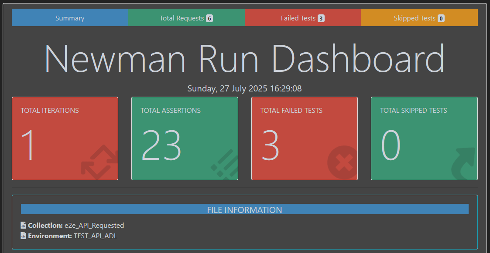

# Testing ADL

Testing with postman, reporting with newman and htmlextra dependecy,
You can see the test results in html format on the "newman" folder.

The Frontend testing repo is in 
[The Front REPO](https://github.com/Ignzika/ADL_TEST_FRONT)
or:
https://github.com/Ignzika/ADL_TEST_FRONT

## Authors

- [@Ignzika](https://github.com/Ignzika)
- [@CarlaMirandaArellano](https://github.com/CarlaMirandaArellano)


## Screenshots




## Running Tests and reporting
The test can be imported on POSTMAN or directly run on terminal.
First install the dependencies of the proyect:

```bash
  npm install newman

  npm install newman-reporter-htmlextra
```
or alternatively: 

```bash
  npm install
```
for running the thes you can use: 
```bash
newman run test/requested_test.json -e test/environment.json -r htmlextra
newman run test/others_test.json -e test/environment.json -r htmlextra

```


## License

this readme was created with [readme.so](https://readme.so/es)

[MIT](https://choosealicense.com/licenses/mit/)

